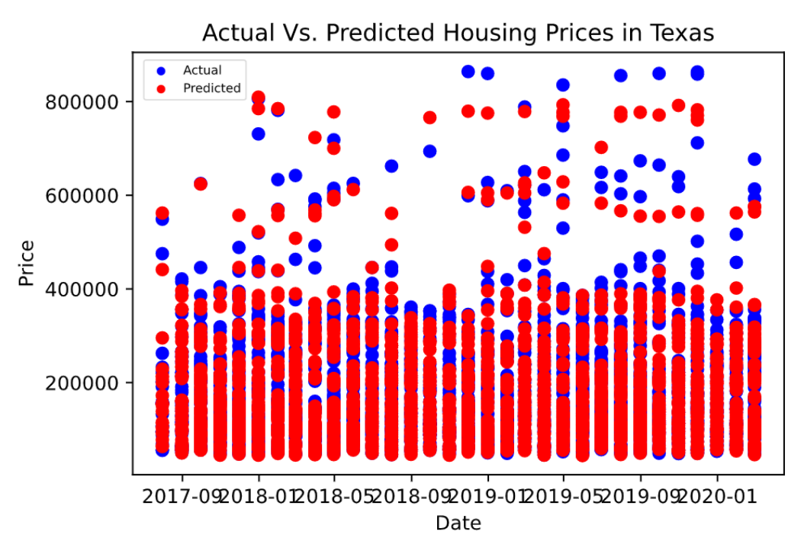

# Texas Housing
This project used deferent Machine Learning models to predict home prices in Texas

## Data 
* This project used data from 2010 to 2020. The data included home prices, number of bedroom, average days in the market, and the Texas's regions. [Kaggle](https://www.kaggle.com/paultimothymooney/zillow-house-price-data?select=DaysOnZillow_City.csv)
* This project also used data 2010 to 2020 of 30 years fixed rate mortgages in Texas including the number of houses sold, the average price, and the interest rate. [ATM_Real_State_Center](https://www.recenter.tamu.edu/data/housing-activity/#!/activity/State/Texas)
  [Freddiemac](http://www.freddiemac.com/pmms/pmms30.html)

## Deep Learning Model 
For this model we used number of bedroom, average days in the market, and the Texas's regions as features and home price as target, which we later separated 70% for training data and 30% for testing data. To create the model, we used three layers with the activation function RELU and Linear for the output layer.
Then, we trained the model using a batch size of 50 and epochs of 5000. We combined and changed all this functions, layers, batch size and epochs looking for the best model. However, the model Loss is 759630336.0 which means the model behaved very poorly with the training data, therefore we can not thrust this model with the tasting data. Also the accuracy of the model is 0.0 which measures the predictions of the model compare to the real data and in this case we can not trust the model's predictions. 
Although we can not trust this model's predictions, we can notice in this plot that the predictions got some prices right.

This outcome means that the feature we used to create the model are not enough to make a good prediction of home prices. Therefore, for future analysis is important to consider more correlated features looking for a more accurate model to predict home prices.

## LSTM Model
We considered the possibility that part of the limitation to our predictive accuracy based on features of the houses in our data was the overall appreciation of the market over the period of time that we studied. In order to capture this trend, we then built a sequential LSTM model and optimized by mean squared error. A sample of our results is included below.

### 1-Bedroom in San Antonio

### 2-Bedroom in Dallas

### 3-Bedroom in Houston

### 4-Bedroom in Austin

In the regions for a given number of bedrooms in which appreciation over time took close to a linear relationship, 1-Bedroom in San Antonio and 3-Bedroom in Houston, for example, our model performed well, with our predicted prices capturing the overall trend of the real prices. In the case of a 3-Bedroom in Houston, our predictions appear to converge with the real prices toward the end of our testing period.

In predicting prices of a 2-Bedroom in Dallas, however, our model was not as accurate. We believe that this is due to the exponential growth in real prices realized toward the end of the training data, which does not continue through our testing period. As can be seen in the plots for this region and number of bedrooms, our predictions conform to this trend in the training data, causing our predictions to miss many of the prices in the testing data by a good margin. However, the fact that these incorrect predictions reflect the training data leads us to believe that eventually our model's predictions would converge with real prices in future data.

Our models predicitions for a 4-Bedroom in Austin were accurate through most of the testing period. However, toward the end of 2018 and into the beginning of 2019, our model failed to predict the upward growth in appreciation in this market. We speculate that this is due to the large growth in the Austin job market, which was ranked No. 2 in the country by Business Insider in 2018 and likely pushed housing prices out of the trend that had been established in the training data. However, we believe that if the growth realized toward the end of our testing period were to continue, our model's predictions would converge with real prices.

## 

